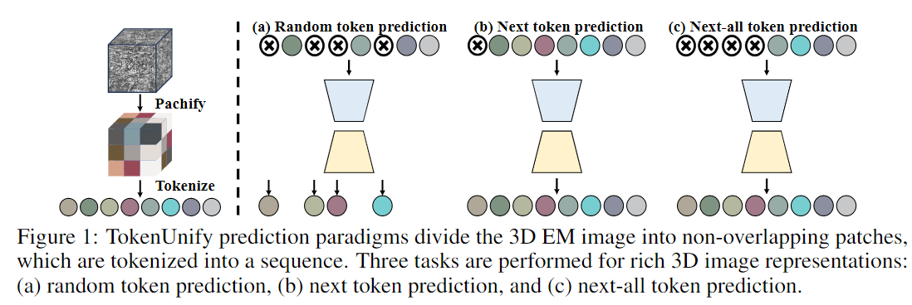
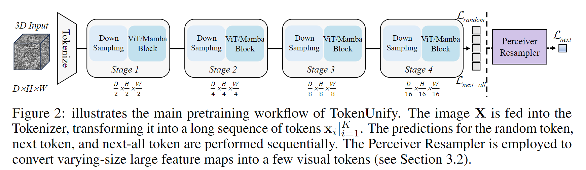
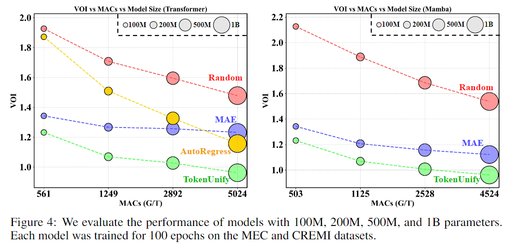
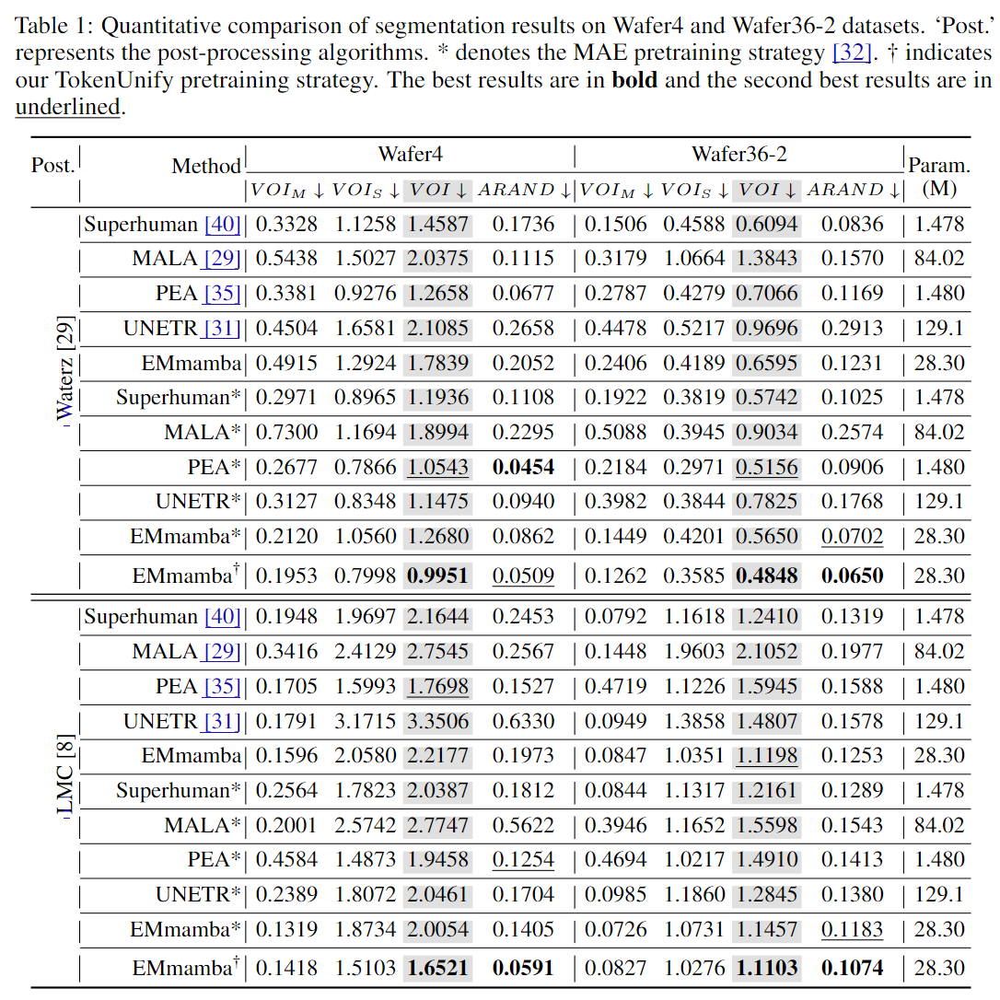
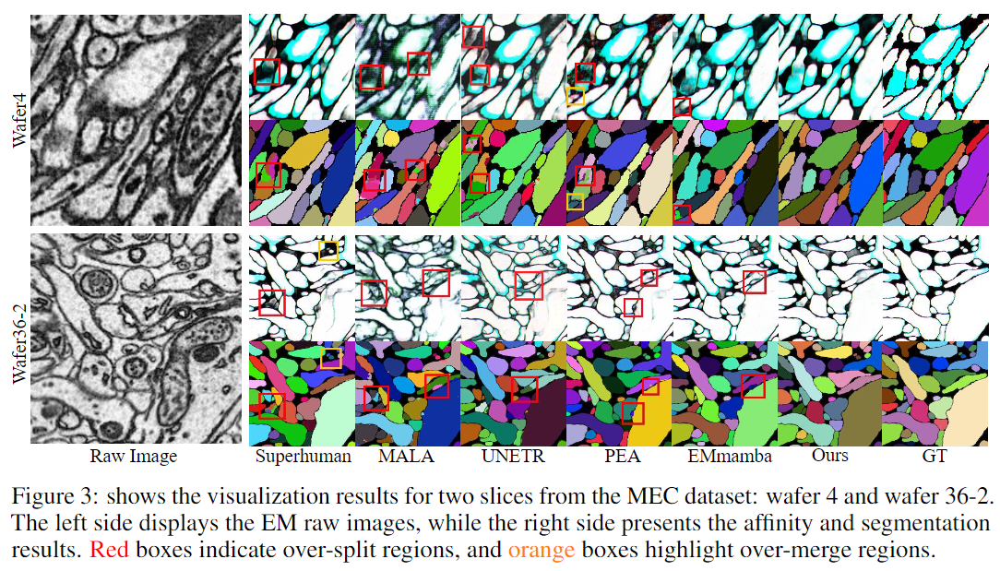

# TokenUnify: Scalable Autoregressive Visual Pre-training with Mixture Token Prediction (Under review)
This repository contains the official implementation of the paper **[TokenUnify: Scalable Autoregressive Visual Pre-training with Mixture Token Prediction](https://arxiv.org/pdf/2405.16847)**. It provides all the experimental settings and source code used in our research. The paper also includes theoretical proofs. For more details, please refer to our original paper.

<div style="text-align: center;">
  
</div>

<div style="text-align: center;">
  
</div>


<!--
<details>
  <summary>Visitor Count</summary>
  
</details>
-->

## Environment Setup

To streamline the setup process, we provide a Docker image that can be used to set up the environment with a single command. The Docker image is available at:

```sh
sudo docker pull registry.cn-hangzhou.aliyuncs.com/mybitahub/large_model:mamba0224_ydchen
```
## Dataset Download

The datasets required for pre-training and segmentation are as follows:

| Dataset Type          | Dataset Name           | Description                              | URL                                           |
|-----------------------|------------------------|------------------------------------------|-----------------------------------------------|
| Pre-training Dataset  | Large EM Datasets of Various Brain Regions | Fly brain dataset for pre-training       | [EM Pretrain Dataset](https://huggingface.co/datasets/cyd0806/EM_pretrain_data/tree/main)  |
| Segmentation Dataset  | CREMI Dataset          | Challenge on circuit reconstruction datasets| [CREMI Dataset](https://cremi.org/)           |
| Segmentation Dataset  | [AC3/AC4 ](https://software.rc.fas.harvard.edu/lichtman/vast/AC3AC4Package.zip) | AC3/AC4 Dataset | [Mouse Brain GoogleDrive](https://drive.google.com/drive/folders/1JAdoKchlWrHnbTXvnFn6pWWwx6VIiMH3?usp=sharing) |
| Segmentation Dataset  | MEC | A new neuron segmentation dataset | Rat Brain (Published after paper acceptance) |

To use this dataset, please refer to the license provided [here](#license-important-).

# License (Important !!!)

<details>
<summary>Usage Notes</summary>

### **Before the public release of the data, the following usage restrictions must be met:**

1. **Non-commercial Use:** Users do not have the rights to copy, distribute, publish, or use the data for commercial purposes or develop and produce products. Any format or copy of the data is considered the same as the original data. Users may modify the content and convert the data format as needed but are not allowed to publish or provide services using the modified or converted data without permission.
   
2. **Research Purposes Only:** Users guarantee that the authorized data will only be used for their own research and will not share the data with third parties in any form.

3. **Citation Requirements:** Research results based on the authorized data, including books, articles, conference papers, theses, policy reports, and other publications, must cite the data source according to citation norms, including the authors and the publisher of the data.

4. **Prohibition of Profit-making Activities:** Users are not allowed to use the authorized data for any profit-making activities.

5. **Termination of Data Use:** Users must terminate all use of the data and destroy the data (e.g., completely delete from computer hard drives and storage devices/spaces) upon leaving their team or organization or when the authorization is revoked by the copyright holder.

### **Data Information**

- **Sample Source:** Mouse MEC MultiBeam-SEM, Intelligent Institute Brain Imaging Platform (Wafer 4 at layer VI, wafer 25, wafer 26, and wafer 36 at layer II/III)
- **Resolution:** 8nm x 8nm x 35nm
- **Volume Size:** 1250 x 1250 x 125
- **Annotation Completion Dates:** 2023.12.11 (w4), 2024.04.12 (w36)
- **Authors:** Anonymous authors
- **Copyright Holder:** Anonymous Agency

### **Acknowledgment Norms**

- **Chinese Name:** 匿名机构
- **English Name:** Anonymous Agency

</details>


## Usage Guide

### 1. Pretraining （Pretraining TokenUnify with 8 nodes）
```
bash src/run_mamba_mae_AR.sh
```
### 2. Pretraining （Pretraining TokenUnify with 32 nodes）
```
bash src/launch_huge.sh
```
### 3. Finetuning
```
bash src/run_mamba_seg.sh
```

## Results
### 1. Scaling law of TokenUnify
<div style="text-align: center;">
  
</div>

### 2. Main Results
<div style="text-align: center;">
  
</div>

### 3. Visual Results
<div style="text-align: center;">
  
</div>

# To-Do List
- [x] Open-sourced the core code
- [x] Wrote the README for code usage
- [x] Open-sourced the pre-training dataset
- [ ] Upload the pre-trained weights
- [ ] Release the private dataset MEC

## Cite
If you find this code or dataset useful in your research, please consider citing our paper:

<!--
## ✨Star History

[](https://star-history.com/#ydchen0806/TokenUnify&Date)
-->
